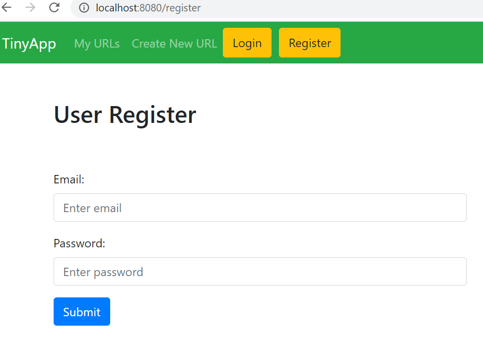
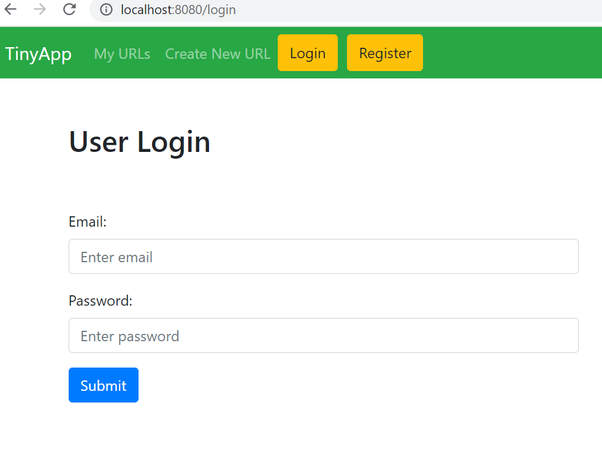
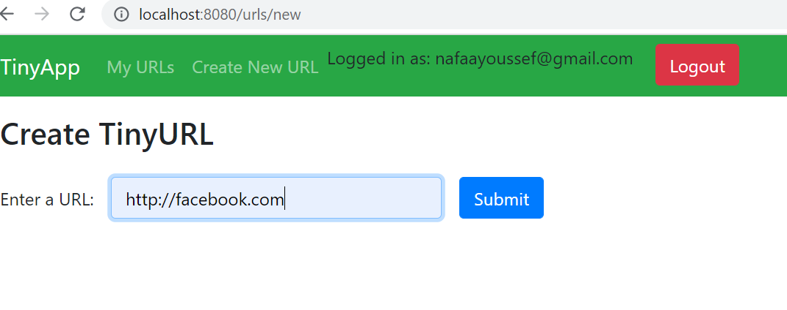
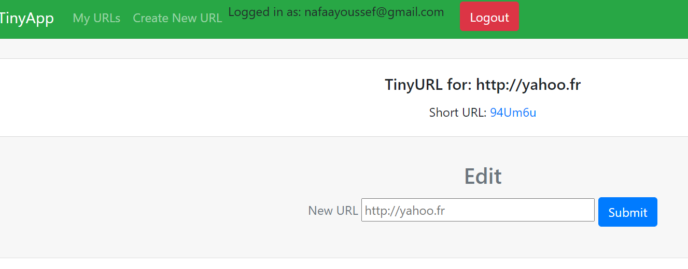
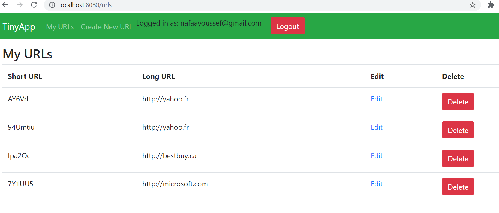

# tinyapp
This app will let users to shorten long URLs.
A user can register and/or log in with its email and password.
A logged-in user can create, update, delete and visulaise all 
the urls that belong to him.
In this app we worked only with objects simulating a database.
Short URLs are simulated with a helper function that can get a random 
text in which the characters are alphanumeric.

# Register Page

# Login Page

# Create Urls

# Edit Urls

# Visualise Urls

# Dependencies
Node.js
Express
ejs
body-parser
bcryptjs
cookie-session
nodemon

# How to start
Run npm install command will install the dependencies.
npm start will run the app automatically with the help of nodemon

